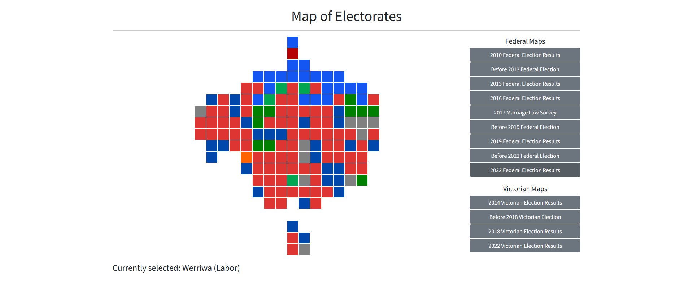

# Australian Electorates Map

This is a React app that shows a cartogram of the seats in the Australian House of Representatives.
Hovering over a seat shows its name and the party of that seat's member. By default the cartogram
shows the current parliament, but past compositions of the house can also be viewed using the
buttons to the right.

Run `yarn start` to start the app.
